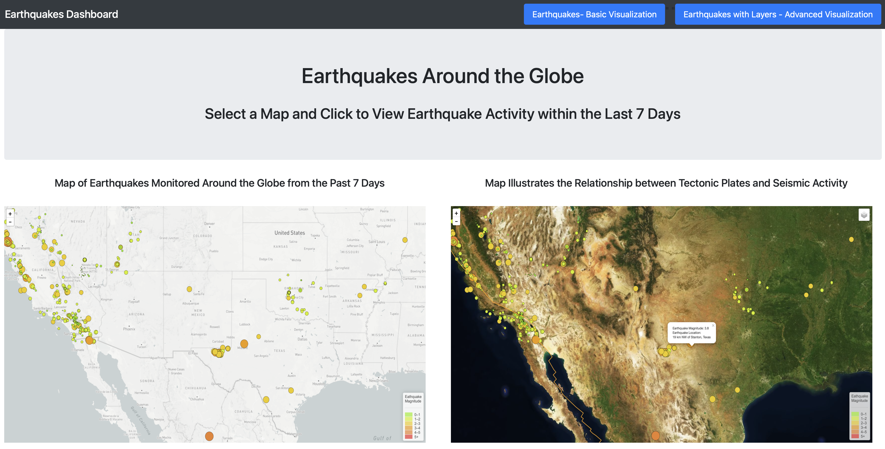
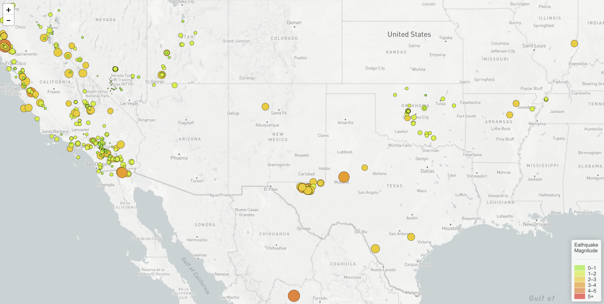

# Leaflet and Javascript - The United States Geological Survey Challenge to Visualize Earthquake
## Background

This repository is designed to provide an interactive way to visualize data so that the USGS can use to help better educate the public and other governments on issues facing our planet.

This project is broken up into 2 parts: 
- Create a basic visualization, for which Leaflet and JSON data were utilized to transform raw data from [USGS GeoJSON Feed](http://earthquake.usgs.gov/earthquakes/feed/v1.0/geojson.php) into an informative visualization of the earthquake dataset provided.  
- Enhance the presentation with ectonic plate & seismic activity data, for which a more advanced and interactive map was created in order to present the data findings in a dynamic and customized approach.

Dashboard Preview:

## Part 1 - Global Earthquake Activity of Last 7 Days (Basic Visualization)

* Basic map using Leaflet which plots all earthquakes from the dataset based on the earthquake's latitude and longitude. 
    * Data markers were also used to reflect the magnitude of the earthquake using via size and color. Earthquakes with higher magnitudes have larger plots and those that have greater depth are represented by a darker color on a spectrum starting from green to red, red indicating intensity.
    * Popups are incorporated to provide additional information about an earthquake when a marker is clicked
    * Legend provides context of the map data.
 
 Basic Map Preview:

## Part 2 - Earthquake, Tectonic Plate & Seismic Activity (Advanced Visualization)

* Advanced Leaflet map which uses data from <https://github.com/fraxen/tectonicplates> and plots the relationship between tectonic plates and seismic activity from the dataset.
    * Additional base maps such as satellite, gray map, and outdoors can be selected. Earthquakes with higher magnitudes have larger plots and those that have greater depth are represented by a darker color on a spectrum starting from green to red, red indicating intensity.
    * The additional datasets have separate overlays which can be independently turned on or off.
    * Layer controls in the legend also provide more viewing options of the map to the user.
 
 Advanced Map Preview:

### Notes & References:

  I created this shareable link to my repository <https://github.com/jdelacruzjr/leaflet-challenge.git> and submitted it to <https://bootcampspot-v2.com>
### Copyright

USGS Image © 2019 All Rights Reserved.

Trilogy Education Services © 2023. All Rights Reserved.